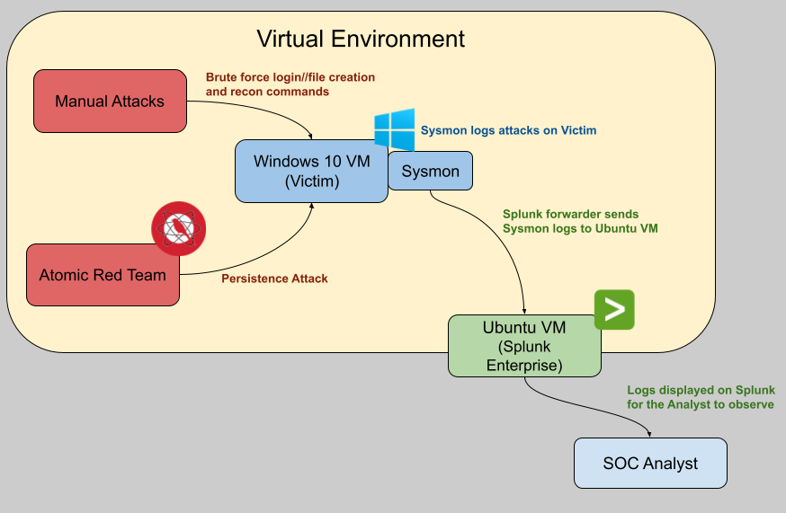
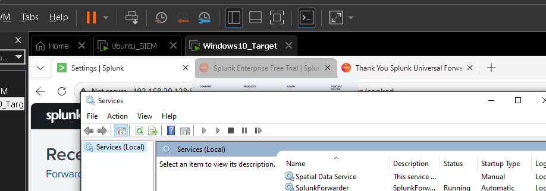

# SOC-in-a-Box: Splunk SIEM Setup and Threat Simulation Lab

## Project Overview
This repository presents the creation, configuration, and testing of a virtualized SOC environment. The objective of this lab is to develop a virtual SIEM, generate detailed and relevant telemetry, and demonstrate the SIEM’s threat detection capabilities through simulated cyber attacks.

### Key Skills Demonstrated
* **SIEM Creation & Configuration:** Built a centralized logging environment using Splunk Enterprise on Ubuntu Server.
* **Log Enhancement:** Deployed Microsoft Sysmon with custom configuration to capture higher quality in depth windows logs.
* **Log Forwarding:** Configured the Splunk Universal Forwarder to direct Windows security events over Port 9997 to the Ubuntu VM.
* **Attack Simulation:** Executed automated adversary behaviors through Atomic Red Team.
* **Threat Hunting & Analytics:** Utilized SPL queries to analyze logs, events and parent-child relationships.
* **Clean Security Practice:** Practiced supply-chain defense through verifying the hashes and digital signatures of installed software.
* **Technical Troubleshooting:** Successfully managed VM resource constraints, software deprecation warnings, and local EDR conflicts.

**Tools & Technologies Used:**
1. VMware Workstation Pro
2. Ubuntu Server 24.04.4 LTS (Splunk Enterprise Server)
3. Windows 10 (Victim Machine)
4. Splunk Universal Forwarder
5. Sysmon (SwiftOnSecurity Configuration)
6. Atomic Red Team

---

## Phase 1: Environment Setup & Operational Security
To ensure a secure lab environment and minimize potential attack vectors, all software installed on the host machine was verified to mitigate the risk of introducing unknown malware. 

### 1. Verification of Host Hypervisor
The VMware Workstation Pro installer was downloaded from the official Broadcom portal. 
1. Verified the digital signature of the .exe file belonging to "Broadcom Inc."
2. Executed PowerShell's `Get-FileHash` command to verify the SHA hash matched the official documentation (`10fe3a36f525d88aa133118ab3b5a16b18da88d4aa11b14d74e4164b3fb94ba9`).

### 2. Operating System Verification
New and clean installations of Ubuntu and Windows were prioritized over reusing old unfamiliar ISOs. 
1. Verified the Windows .exe installer digital signatures.
2. Verified the Ubuntu ISO hashes against the official websites documentation using PowerShell.

### 3. Virtual Machine Provisioning
Allocated specific hardware resources to balance host performance and lab requirements.
1. **Windows 10 VM:** 60 GB Disk, 4 GB RAM, 2 Cores. Installed VMware Tools for facilitation of management.
2. **Ubuntu VM:** 40 GB Disk, 4 GB RAM, 2 Cores. Executed `sudo apt update && sudo apt upgrade -y` for baseline security patches. 
3. Confirmed network connectivity between VM's by successfully pinging the Ubuntu Server (`192.168.20.128`) from the Windows host.

---

## Phase 2: SIEM Configuration & Telemetry Routing
Established the SIEM for centralized logging and configured the victim machine to forward event data.

### 1. Splunk Enterprise Deployment
1. Downloaded Splunk to the Ubuntu server via `wget` and installed using `sudo dpkg -i`.
2. Successfully started the `splunkd` service and accessed the web GUI on the Windows 10 VM via `http://192.168.20.128:8000`.
3. Configured Splunk to actively listen for incoming data on Port 9997.

### 2. Universal Forwarder Installation
1. Installed Splunk Universal Forwarder (v10.2.2) on the Windows 10 VM.
2. Pointed the forwarder to the Ubuntu IP (`192.168.20.128`) on Port 9997.
3. Verified the Splunk Forwarder service was active on the Windows VM `services.msc`.

---

## Phase 3: Advanced Telemetry Configuration
Standard Windows event logs often are too shallow and offer unsatisfactory information for deep threat hunting. Sysmon was integrated to capture specific execution paths and process histories.

### 1. Sysmon Implementation
1. Downloaded Sysinternals Sysmon to the Windows VM.
2. Applied the SwiftOnSecurity `sysmonconfig-export.xml` configuration to filter out benign logs and capture crucial security events.
3. Executed the installation via elevated Command Prompt: `sysmon64.exe -i sysmonconfig-export.xml -accepteula`.

### 2. Data Normalization
1. Installed the Splunk Add-on for Microsoft Windows on the SIEM.
2. This allowed Splunk to automatically parse Sysmon's raw XML logs into readable, categorized fields like `User`, `CommandLine`, and `ParentImage`.

---

## Phase 4: Threat Simulation & Detection Validation
Conducted three separate attack simulations to verify that the SIEM was correctly ingesting, parsing, and forwarding malicious activity to be displayed correctly.

### Simulation A: Brute Force Authentication
1. **The Attack:** Manually triggered 10 consecutive failed login attempts on the Windows VM to simulate a brute force credential attack.
2. **The Detection:** Queried Splunk for `index=* sourcetype="WinEventLog:Security"`. Identified a massive spike in activity. Investigated individual logs to confirm the presence of `Event ID 4625` (An account failed to log on).

### Simulation B: Suspicious Command Line Discovery
1. **The Attack:** Simulated basic adversary reconnaissance by executing `whoami`, `ipconfig /all`, and `net user` in the Windows command prompt.
2. **The Detection:** Used the search `index="main" source="XmlWinEventLog:Microsoft-Windows-Sysmon/Operational" | stats count by CommandLine`. Successfully located exactly 5 instances of `ipconfig /all`, 5 of `net user`, and 4 of `whoami`.
3. **Deep Dive:** Used a targeted query referencing `ParentImage` to prove that `C:\Windows\System32\cmd.exe` was the root source of the execution, confirming Sysmon's tracking capabilities.

### Simulation C: Persistence via Atomic Red Team
1. **The Attack:** Downloaded and installed the Invoke-AtomicRedTeam execution engine via PowerShell. Triggered a test simulating an attacker establishing persistence via Registry Run Keys: `Invoke-AtomicTest T1547.001 -TestNumbers 1 -PathToAtomicsFolder "C:\AtomicRedTeam\atomics\atomics" -Force`.
2. **The Detection:** Searched Splunk for PowerShell parent images (`index=* (Image="*powershell.exe" OR ParentImage="*powershell.exe") | table _time, Computer, User, CommandLine, ParentCommandLine | sort - _time`). Successfully identified the exact timestamp and the `reg.exe` commands executing the persistence attack.

---
## MITRE ATT&CK Mapping

For additional context to the simulated adversary activity, the commands and attack techniques were mapped to the MITRE ATT&CK framework below. This framework, which is a "globally-accessible knowledge base of adversary tactics and techniques" according to the MITRE ATT&CK website, is widely used by security teams to categorize attacker behavior and improve detection coverage.

| Simulated Activity                             | ATT&CK Technique                       | Technique ID |
| ---------------------------------------------- | -------------------------------------- | ------------ |
| Failed Login Attempts                          | Brute Force                            | T1110        |
| whoami                                         | System Owner/User Discovery            | T1033        |
| net user                                       | Account Discovery                      | T1087        |
| ipconfig /all                                  | System Network Configuration Discovery | T1016        |
| Registry Run Key Persistence (Atomic Red Team) | Registry Run Keys / Startup Folder     | T1547.001    |
| PowerShell-Based Attack Execution              | PowerShell                             | T1059.001    |

The successful detection of these activities within Splunk demonstrated the virtualized SIEM's ability to collect, forward, and analyze telemetry associated with common attacker behaviors.

## Challenges Faced

1. **Splunk Root Execution Deprecation:** During the Ubuntu Splunk installation, running the start command threw a warning that root execution was deprecated. After researching the warning, I purposefully bypassed it using `--run-as-root` to keep the lab environment strictly focused on ingestion rather than complex Linux permission management. While this allowed me to focus on building the SIEM to move forward with the lab, it does pose a security risk outside of a lab environment. I would not run it as the root user in practice outside of the lab environment to avoid the risk of an attacker exploiting a vulnerability in Splunk while its in root and gaining access to the OS.
2. **SIEM Resource Overload:** Initially, the Splunk dashboard showed no logs and displayed a yellow warning sign indicating output degradation. The 4 GB RAM allocation on the VM was struggling to process the realtime "All Time" query of the Windows Security logs. Changing the timeframe scope to "Realtime: 30 Minute Window" immediately resolved the latency and allowed the data to populate. This posed a challenge mainly due to no obvious clues of the problem and my lack of experience with splunk requiring me to troubleshoot it with the intuition I had on systems.
3. **EDR/Antimalware Interference:** When unzipping the Atomic Red Team library, Windows Defender triggered severe alerts (flagging `wacatac.b!ml` and `malgent!MSR`) and actively deleted the simulation scripts. To allow the simulation to proceed, I configured a specific exclusion path in Defender using PowerShell (`Add-MpPreference -ExclusionPath "C:\AtomicRedTeam"`), effectively bypassing the host protection. I also had to go into Windows Defender and manually undo the deletions it had made. Moving forward when simulating adversarial attacks in a virtual environment, I will make sure to configure Defender and any other antimalware solutions accordingly while also taking precautions to protect my host device from that opened attack vector (like turning off network connection when running software/attacks, switching to host-only, etc).
